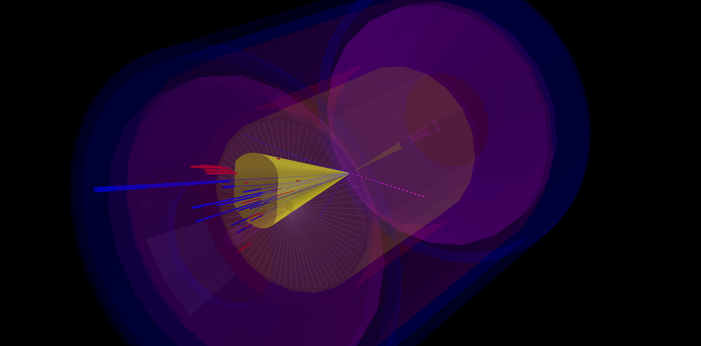
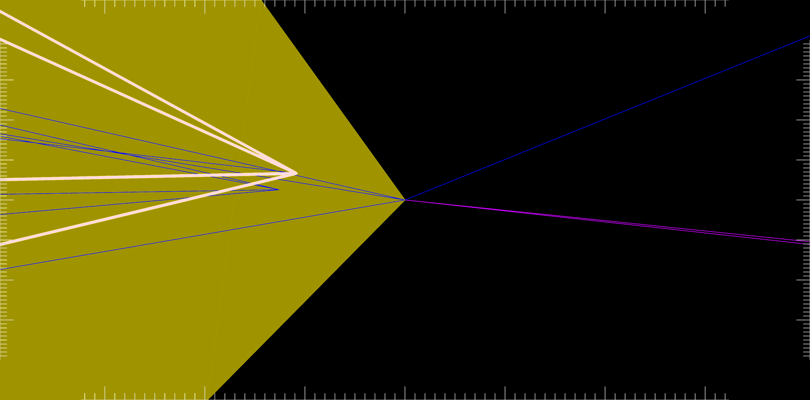

# delphes_EIC

Welcome to the ```delphes_EIC``` project. This code aims to deliver a fast-simulation model of baseline or specific detectors for studies to support the Electron-Ion Collider (EIC) project. This code has been used in a few publications and papers and parts of it are available for citation through Zenodo:

* <b><a href="https://inspirehep.net/literature/1802504">Charm jets as a probe for strangeness at the future Electron-Ion Collider</a></b>. <a href="https://inspirehep.net/authors/1203346">Miguel Arratia</a> (<a href="https://inspirehep.net/institutions/903304">UC, Riverside</a> and <a href="https://inspirehep.net/institutions/904961">Jefferson Lab</a>), Yulia Furletova (<a href="https://inspirehep.net/institutions/904961">Jefferson Lab</a>), <a href="https://inspirehep.net/authors/1057163">T.J. Hobbs</a> (<a href="https://inspirehep.net/institutions/905856">Southern Methodist U.</a> and <a href="https://inspirehep.net/institutions/904961">Jefferson Lab</a>), <a href="https://inspirehep.net/authors/994916">Fredrick Olness</a> (<a href="https://inspirehep.net/institutions/905856">Southern Methodist U.</a>), Stephen J. Sekula (<a href="https://inspirehep.net/institutions/905856">Southern Methodist U.</a>). e-Print: <a href="https://arxiv.org/abs/2006.12520">2006.12520</a>[hep-ph]
* <b><a href="https://inspirehep.net/literature/1851396">A Delphes card for the EIC yellow-report detector</a>.</b> <a href="https://inspirehep.net/authors/1203346">Miguel Arratia</a> (<a href="https://inspirehep.net/institutions/903304">UC, Riverside</a> and <a href="https://inspirehep.net/institutions/904961">Jefferson Lab</a>), <a href="https://inspirehep.net/authors/1021142">Stephen Sekula</a> (<a href="https://inspirehep.net/institutions/905856">Southern Methodist U.</a>). e-Print: <a href="https://arxiv.org/abs/2103.06886">2103.06886</a>[physics.ins-det]. DOI: <a href="https://doi.org/10.5281/zenodo.4592887">10.5281/zenodo.4592887</a>(publication)
* <b><a href="https://inspirehep.net/literature/1851258">Science Requirements and Detector Concepts for the Electron-Ion Collider: EIC Yellow Report</a></b>. <a href="https://inspirehep.net/authors/1706729">R. Abdul Khalek</a>, <a href="https://inspirehep.net/authors/1019006">A. Accardi</a>, J. Adam, D. Adamiak, W. Akers et al. e-Print: <a href="https://arxiv.org/abs/2103.05419"> 2103.05419 </a>[physics.ins-det]

<p>


</p>

## New!

* EIC PID code has been used to create IdentificationMaps for the mRICH, barrelDIRC, and dualRICH. No more external code needed!

## Instructions

1. Install PYTHIA8.3 following the instructions below, because code-patching is necessary to fix a bug in the DIS simulation.

2. Install Delphes3 following: https://github.com/delphes/delphes


## EIC Yellow-Report Detector Models

The current model we recommend is ```delphes_card_allsilicon_3T.tcl```, which is based on detector studies from the EIC Yellow Report (https://arxiv.org/abs/2103.05419). This model incorporates all-silicon tracking, and EMCAL and HCAL. PID system responses are provided by efficiency maps based on EIC PID code (https://gitlab.com/preghenella/pid/). 

* Magnetic field: 3.0 T
* Solenoid length: 2.0 m
* Tracker radius: 80 cm

We currently simulte DIS using Pythia8 within Delphes. Again, detailed instructions for patching and installing it are below. The command file (ending in `.cmnd`) shown here is suitable for DIS at EIC. 

### Generating Events

Run generation command:
`./DelphesPythia8 cards/delphes_card_allsilicon_3T.tcl CC_DIS.cmnd out.root`

You can see examples of analysis code in the Delphes page above

### Visualizing Events 

Run visualization command:
 `root -l examples/EventDisplay.C'("delphes_card_allsilicon_3T.tcl","out.root")'`
 
The two examples shown here are for neutral-current and charged-current event for beam energies of 10 GeV electron on 100 GeV proton (63 GeV center-of-mass energy). 


# Code Installation

Below, the environment variable ```${INSTALLDIR}``` refers to some folder where you are putting all your EIC fast simulation code (e.g. ```export INSTALLDIR=${HOME}/EIC/```).

1. Install LHAPDF
   * https://lhapdf.hepforge.org/
   * Using LHAPDF 6.2.3
   * Download the tarball and unpack it
   * BUGFIX in 6.2.3: there is a python coding error in bin/lhapdf. Edit this file and find and replace "add_add_mutually_exclusive_group" with "add_mutually_exclusive_group"
   * Configure it for local installation in your work area, e.g. ```./configure --prefix=${INSTALLDIR}/EIC/```
   * Build it, ```make -j```,
   * Install it, ```make install```,
   * Make sure the environment is set properly to find the binaries, libraries, and python code (c.f. https://lhapdf.hepforge.org/install.html#lxplus for examples)
1. Install PYTHIA8,
   * http://home.thep.lu.se/~torbjorn/Pythia.html,
   * Download the tarball and unpack it. ,
   * Patch Pythia8: There is a known BUG in Pythia8.X that affects deep-inelastic scattering (DIS) simulations. To fix this, you need to follow the instructions below on "Patching Pythia8 for DIS". **DO THIS NOW**
   * Configure it for local installation in your work area, e.g. ```./configure --prefix=${INSTALLDIR}/EIC/ --with-lhapdf6=/scratch${INSTALLDIR}/EIC/```,
   * Build it, ```make -j```,
   * Install it, ```make install```,
   * Make sure the work area binary directory is in your PATH: ```PATH=${INSTALLDIR}/EIC/bin:${PATH}```,
1. Install Delphes,
   * https://github.com/delphes/delphes,
   * Clone the project and make sure you are on the master branch,
   * Make sure ROOT is available in your path, e.g. ```lsetup \"root 6.18.04-x86_64-centos7-gcc8-opt\"```,
   * Set environment variables for building: ```export HAS_PYTHIA8=true; export PYTHIA8=${INSTALLDIR}/EIC```
   * Configure: ```./configure --prefix=${INSTALLDIR}/EIC/```,
   * Build: ```make -j```,
   * Install: ```make install```,

## Patching Pythia8 for DIS

* Edit the following file in your Pythia8 source directory: `src/BeamRemnants.cc`
* Go to the `BeamRemnants::setOneRemnKinematics` method (it will begin around line 960 or so)
* Find the lines that look as follows:

```
int iLepScat = isDIS ? (beamOther[0].iPos() + 2) : -1;
```
* Add the following lines just below this code:
```
if (iLepScat > (event.size()-1)) {
   // Occasionally, the remnant is missing from the record.
   // Return false 
   return false;
 }
```

Now compile the Pythia8 code. This will fix the bug.

## Running Monte Carlo Production

The following command line will run these options:

* e-p beam energies of 10 and 275, respectively
* LHAPDF6:CT18NNLO PDF set
* Output will be written to CC_DIS_e10_p275_CT18NNLO/0/ (where 0 is the task ID, specified using SLURM_ARRAY_TASK_ID)
* 100,000 events generated in a single run of the command

```
SLURM_ARRAY_TASK_ID=0 ./run_study.py --template delphes_card_allsilicon_3T.tcl --commands CC_DIS_template.cmnd -p '{"PARAM_NEVENTS": 100000, "PARAM_HADBEAM_ENERGY": 275, "PARAM_EBEAM_ENERGY": 10, "PARAM_PDFSET": "LHAPDF6:CT18NNLO"}' -n CC_DIS_e10_p275_CT18NNLO
```

### EIC Collider Variations

Beam energy recommended benchmarking points are (the order is hadron on lepton):

* 275 on 18 GeV
* 100 on 10 GeV
* 100 on 5 GeV
* 41 on 5 GeV


# The "SimpleAnalysis" framework

See the dedicated [SimpleAnalysis Code Design README file](SimpleAnalysis/README.md).

