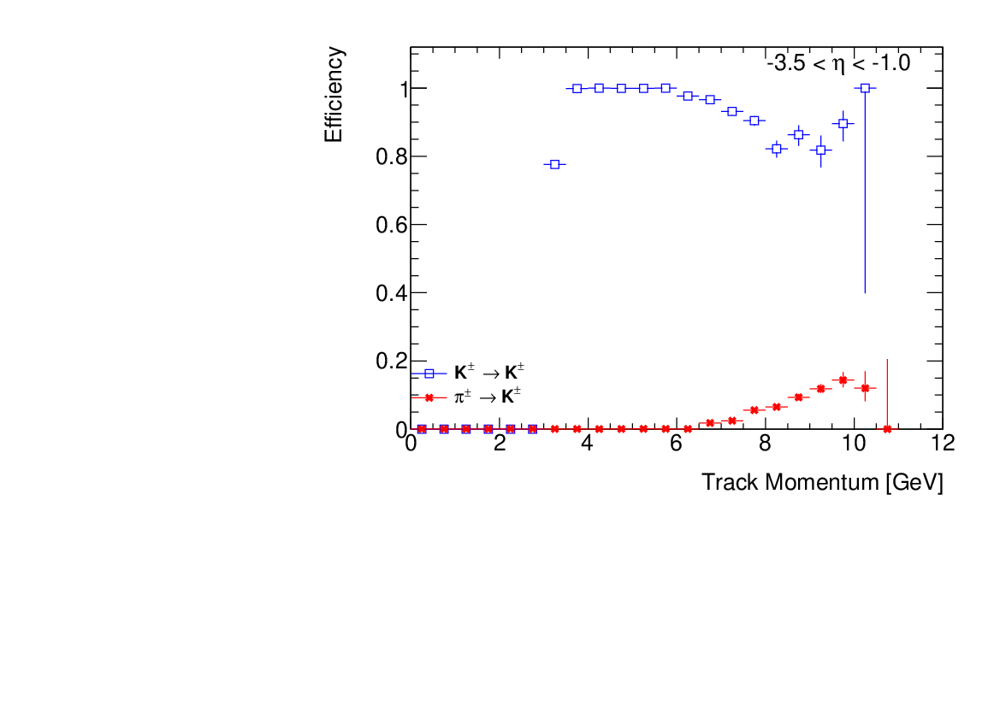
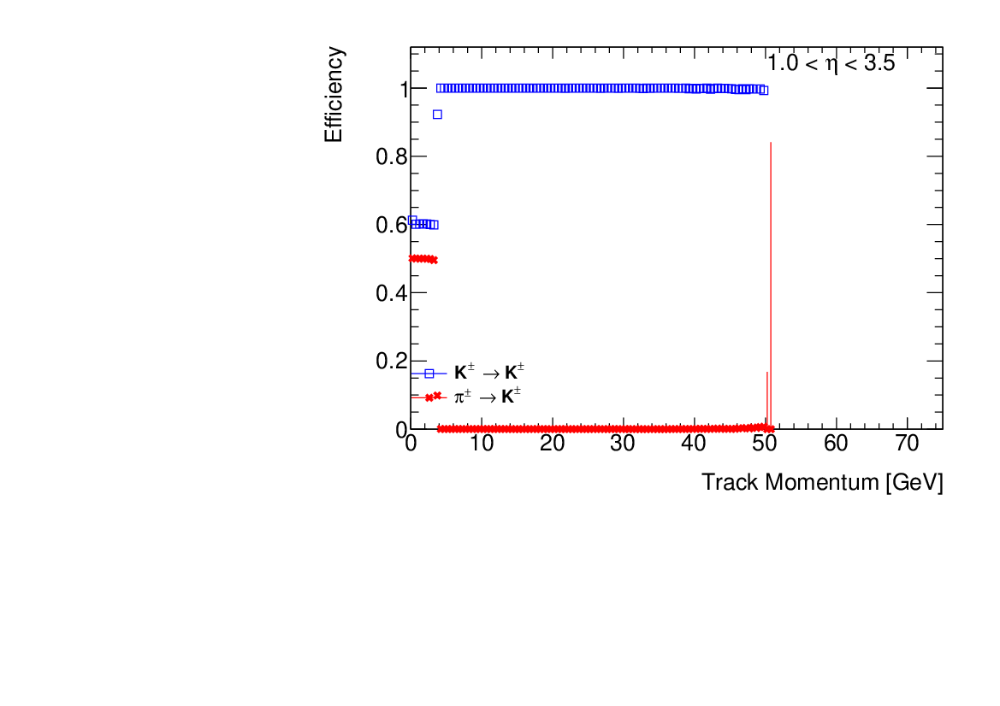

# SIMPLEANALYSIS

* Based on ideas from the BaBar and ATLAS Experiments, including the SimpleComposition framework (BaBar) and the CxAOD2 framework (ATLAS)
* Intended for fast analysis of Delphes-produced ROOT TTree structures
* Requirements: Delphes and GCC 8.X or higher to compile (utilizes C++-14)

## Author(s)

* Stephen Sekula (original)

## Building

SimpleAnalysis comes with the delphes_EIC project for now. It contains a standalone Makefile. To build it:

```
cd SimpleAnalysis/
export DELPHES_PATH=<PATH WHERE DELPHES IS LOCATED>
make
```

If you don't set ```DELPHES_PATH```, make will complain until you do. :-)

## Running

Eventually, SimpleAnalysis will use a text configuration file to setup the execution (creation of analysis modules, order of execution, etc). For now, you can specify all of this on the command line.

For example, let's imagine you have produced a bunch of ROOT files using Delphes. Imagine the are located in a folder called ```Delphes_Output/```. To process those files using SimpleAnalysis:

```
./SimpleAnalysis.exe --input_dir Delphes_Output/ --output_file SimpleAnalysis_Results.root --module_sequence KaonPIDModule,ElectronPIDModule,MuonPIDModule,TaggingModule,EventSelectionModule --nevents 100
```

This will load (by "globbing") all ROOT files found in ```Delphes_Output/```, write any eventual output to ```SimpleAnalysis_Results.root```, execute the modules KaonPIDModule, ElectronPIDModule, MuonPIDModule, TaggingModule, and EventSelectionModule in the specified order, and process just 100 events from the input ROOT files.

## Code Structure

### SimpleAnalysis.cc

This is the backbone of the code. It provides the main execution function. This globs all the ROOT files together from the input directory, instantiated any singleton-pattern classes needed for execution (more on those below), and then runs the event loop on the input ROOT files. In each element of the loop, it called all analysis modules in the order specified and uses their ```::execute()``` method to accomplish their intended tasks. It then fills the output event TTree once per loop execution, and repeats until it meets the target number of events or the end of the input ROOT files.

Singleton-pattern classes are used for global objects that should only ever have one instance in memory. These are:

* A TTree handler: this holds all branches for the output file and fills them when requested. You can add branches to this TTree from any module, but don't call the ```::Fill()``` method on your own; SimpleAnalysis.cc handles that.
* A Module handler: this keeps a record of all modules loaded, as well as their order; it can be used before the event loop to initialize modules, execute them during the event loop, and finalize them afterware.

### ModuleHandler.h (Singleton)

This keeps a record of all active modules and the order in which they are loaded. They are initialized, executed, and finalized in that order. There is only 1 instance of this class.

### TreeHandler.h (Singleton)

This holds the single output file and the tree inside of it. Eventually, this should be expanded to allow multiple trees, folders, etc. A richer structure is possible here.

### Module.h

The base class of all analysis modules. This defines basic functions like initialize, finalize, and execute, which are generally to be overridden by derived (child) classes.

### Module Child Classes

The existing examples are:

* {Kaon, Electron, Muon}PIDModule: takes tracks and uses truth-level information to mark a track as identified or not (as a kaon, muon, or electron, depending on the module)
* TaggingModule: applies tagging methods to jets and returns a list of "charm jets" based on the tagging score.
* TaggingStudyModule: a heavy module that loops over tagging hyper-parameters and writes out a large CSV file containing the results on light- and charm-jets of applying different configurations of tagging. This can be used to optimize the hyper-parameters. Don't use this as a matter of regular analysis.
* EventSelectionModule: an example of an "analysis" module; it generates a cutflow output CSV file based on the selection criteria in its execute method. For now, it writes every event to the output tree even if the event fails a cut criterion. 

### AnalysisFunctions.h

Defines inline global analysis functions (e.g. flavor tagging computations, DIS variables, etc.) that might be useful across modules. This would benefit from having a namespace that contains all its functions.


## Future Development Ideas

* A text-based configuration file, rather than the command-line module sequence specification
* Modules can be named so that there can be multiple instances, if needed, to perform distinct tasks. They can then be looked up by name.
* Modules should be configurable using the text-based config file, rather than using hard-coded values for their functions, which is the current practice.
* A CutFlow tool should be added to streamline the process of adding, incrementing, and saving cut flows.

# Particle ID Studies

Particle ID efficiency maps have been introduced in the delphes_card_allsilicon_3T.tcl card. These model PID systems from eta=[-3.5,3.5], with an mRICH in the backward direction, a DIRC in the barrel, and a dualRICH in the forward direction. Below are example PID efficiency plots made using variables produced by SimpleAnalysis.





The variables produced by the SimpleAnalysis EventAnalysisModule that are relevant for studying track-level particle ID efficiency all begin with ```pid_track_*```. They are stored for every track in the angular coverage of the PID subsystems. The efficiency plots are made by projecting into two histograms the pT spectra of all tracks, or just tracks identified by a system, in the fiducial regions. To compute the ```X -> Y``` efficiency, the denominator (all tracks) histogram contains tracks that are truly of species ```X``` (```pid_track_true_pid```); the numerator histogram contains tracks reconstructed by the PID system as ```Y``` (```pid_track_reco_pid```).

The plots above were made using the script ```scripts/KaonIDEfficiency.C```. If the ROOT files resulting from running SimpleAnalysis are all in a directory called ```EICatIP6_PID_AllSilicon_3T```, then here is an example of running the script to compute the Kaon ID efficiency using the Dual RICH tracks. This includes the complete workflow for generating events, processing them with SimpleAnalysis, and making the plots:

```
mkdir delphes_card_allsilicon_3T/
DelphesPythia8 delphes_card_allsilicon_3T.tcl CC_DIS.template delphes_card_allsilicon_3T/out.root
cd SimpleAnalysis/
make -j2
mkdir allsilicon_3T
./SimpleAnalysis.exe --input_dir ../delphes_card_allsilicon_3T/out.root --output_file allsilicon_3T/out.root --module_sequence 'ElectronPIDModule,MuonPIDModule,TaggingModule,EventSelectionModule'
cd scripts/
root -q -l -b ./KaonIDStudy.C'+("../","allsilicon_3T/", "mRICHTrack", "*.root")'
root -q -l -b ./KaonIDStudy.C'+("../","allsilicon_3T/", "barrelDIRCTrack", "*.root")'
root -q -l -b ./KaonIDStudy.C'+("../","allsilicon_3T/", "dualRICHTrack", "*.root")'
```

## Notes on the dualRICH

The dualRICH has two components: aerogel (good for low-momentum) and C2F6 (good for high momentum). The transition in performance for these two subsystems occurs around 12 GeV/c of track momentum. As such, for tracks with momentum less than that threshold, the aerogel alone is used to make the PID decision. Above the threshold, C2F6 alone is used to make the decision. This results in a relatively flat performance in the efficiency plot for kaons, as expected.


